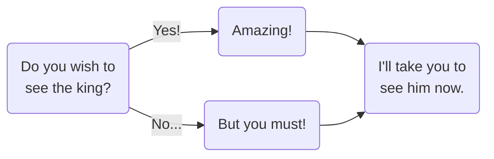

All games, from playgrounds to sports stadiums to video game consoles, are built on a series of underlying systems. The most enduring games combine these systems to create something highly engaging with a satisfying ending.

## Engagement
A good game keeps players engaged. Engagement is largely composed of three factors: randomness, intermittent rewards and choices. Choices will be covered in-depth in the next section.

### Randomness

For inexperienced gamers or those with less gaming skill, adding some degree of randomness (or luck) makes a game more approachable. Making the player less responsible for the outcome (offering them the ability to blame a loss on bad luck) levels the playing field. For those with so much gaming skill that beating a game on skill alone could be done with their eyes closed, randomness can make a game more variable and replayable.

Still, too much randomness removes player agency. A purely random game like Chutes and Ladders or Candyland is only really appealing to young children who are not yet able to make strategic decisions. Playing purely-random slot machines too much is regarded as an addiction.

Purely skill-based games, like chess, are popular among all groups, but take a steep learning curve and are often viewed as unapproachable by unfamiliar players. Generally, you want to strike a balance between the two.

Randomness can take multiple forms. In physical games, it often takes the form of dice rolls or drawing cards. In video games, it can take the form of quick-time events, artificially intelligent enemies or invisible choices.

### Intermittent rewards/score

When playing a game, being rewarded provides a little bit of dopamine and, subsequently, motivation to keep playing. It’s best to pace these intermittently: making them too common will dull their effect, while spacing them out too hard can have players bored or even questioning whether or not they are playing the game correctly. It is also important to give the player cues when they are doing things correctly—this can be as simple as playing a pleasant sound or small dialogue popup. Many games do this by keeping a running score, often by collecting cards, tokens or coins.

“Reward” can mean many things: it could be new dialogue from a character, a collectible item or score multiplier. Pacing is key—spamming these rewards makes the positive feeling less effective, but spacing them out too far can cause the player to feel lost or disinterested. Take care to ensure that these rewards are easily visible and understood by the player.

## Choices

When designing any kind of game, including IF, choices are the primary way to engage the player. Choices are measured by whether or not they are **meaningful and/or interesting**. It is possible for choices to fulfill both or neither criteria.

- **Meaningful choices** have an effect on the game’s state, such as the player’s status or score. 
- **Interesting choices** engage the player and require them to think about their decision. 

All types of choices have relevant use cases depending on what you are trying to portray and want to emphasize or de-emphasize player agency. Most of the examples below are adapted from Clara Fernández-Vara’s [Taxonomy of Narrative Choices](https://clarafv.itch.io/taxonomy-of-narrative-choices), itself made with Twine.

### Meaningless choices

These choices do not affect the narrative outcome.

No matter the decision, the player is taken to the king. Meaningless choices are typically poor practice, wasting the player’s time to no effect.

However, meaningless decisions can be advantageous in two cases:

1. Deliberately emphasizing a lack of agency or creating a sense of frustration.
2. Character customization. It almost never has an effect on the narrative, but can make users feel more represented by (and thus, invested in) their characters. 

But on the whole, these types of choices are neither interesting nor meaningful. 

### Unfair choices

Unfair choices are ones where the player has no idea to know which decision is correct or helpful. Unlike meaningless decisions, these are decisions that do affect the way the game progresses; they are not interesting decisions because the player cannot consult their knowledge base.

> There are three doors. Behind one door is a rabid werewolf, another a treasure chest full of gold, and the last one a single paperclip. There are no clues as to which door is which. You can only open one door. Which one do you choose?

Unfair choices can be useful for generating nervousness or apprehension. Almost all types of gambling rely on unfair choices, and it’s safe to say they’re popular. (Unfair choices were formerly referred to as blind choices; you may still see this term in game design textbooks.) These are uninteresting, but typically meaningful.

### Tradeoffs

These are choices when players do not have enough resources to achieve all of their goals and must choose to prioritize.

> You have 10 coins. Food, which will give you energy to travel further, costs 6 coins. A more powerful weapon, which will allow you to fight stronger enemies, costs 10 coins. What purchase will you make?

Since the player does not have enough money for both, they must choose whether they want to prioritize energy or firepower—or their wallet, if they decline to buy either. This allows the player to develop their own strategy and decide how they wish to move through the game space. These are often both interesting and meaningful.

### Dilemmas

A difficult choice that poses a moral question and often requires players to feel bad.

> You are an underpaid FDA official whose family is starving. A shady figure offers you a bribe to approve their dubious hair growth treatment. It looks like it could seriously harm users, but you don’t know how you’ll feed your family without that bribe money. Do you take the money?

These emphasize nuance and self-reflection in the player. Typically it puts two (or more) values into direct conflict and the player must decide which is more important to them. These are interesting and meaningful.

### Invisible choices

These are choices the player does not know they are making, hidden in the game’s code.

> A game may have an internal “boldness” variable. Every time a player is confronted with a dilemma and makes a conservative decision, the value decreases; for every bold decision it increases. This value is never displayed to the player. At the end of the game, the player will receive either the “brave” or “cowardly” ending depending on the variable’s value.

Invisible choices make the players feel that their actions have consequences and provide a richer experience. They also add replay value to the game, as players may want to replay to get different endings or to try to review or understand why they got the outcome they did. In this way, invisible choices also add randomness: while they are not truly random, they are random to the player because they are hidden. These are one of the most sophisticated ways of incorporating meaning.

### Balanced choices

A choice can be regarded as balanced when it does not have an obvious right or wrong answer. Generally, these are the kind of decisions that are most rewarding to players (as they provide the most agency) and that a game developer should seek to include.

## Cooperation, competition and co-opetition

When games are multiplayer, players can work together to achieve a single goal (cooperation) or against each other to be the “best” (competition). Some games feature aspects of both, called co-opetition. Of course, different types of gameplay create different moods and serve different purposes.

Cooperative games can be more approachable for new players who are not confident in their gaming skills or strategic prowess and fearful of losing. Competitive games have the benefit of providing a boost of engagement, provided they are balanced. When competitive games become unbalanced, players check out mentally (for example, Monopoly is notorious for getting miserably slow in its endgame as all properties are purchased and players slowly wait for bankruptcy).

## Visuals

While plot and active gameplay are the meat and potatoes of game design, visuals play an important role in setting the tone. Keep in mind what you are seeking to convey and whether your color, fonts and design elements (including user interface) support that. Most of this is common sense: softer colors keep things calmer, bright colors can encourage playfulness and dark colors often convey a more serious tone; a sans serif font can convey modernity while you may want to try Courier or a blackletter for a historical game.

If designing a user interface, you should almost always aim to make it intuitive and easy to navigate, lest your players become confused (or give up completely!) before the game even begins. Making a user interface difficult to navigate can have its uses if you are trying to convey frustration, although this is a very niche case. While basic design principles apply, figuring out how usable your interface actually is can only really be achieved via user testing.

## Endings (or lack thereof)

It is a common belief that games are played purely to win. While many games have either/or conditions that must be met to receive a winning or losing ending respectively, some have multiple possible **win conditions** and some are completely open-ended, with no way to win or lose.

>Reaching the final flag is the win condition for each level in Super Mario Bros. Taking too much damage from an enemy, falling off of the bottom of the screen or running out of time are the loss conditions. 

> In many **multiplayer games**, merely another player achieving the win condition is your loss condition—when another Uno! player gets rid of all of their cards, they have won and you have lost. 

Although win/loss conditions seem very black-and-white, many still allow player agency and creativity.

> The player character has to defeat a powerful boss to win. A player can choose to play riskily by staying close to the enemy, allowing them to land more hits while risking taking more damage themselves. Or they could also choose to stay far away, using ranged battle which depletes more resources but makes taking damage more unlikely.

  
### Winless games

Many games are not about winning or losing, including a large swath of IF. Open-ended games such as Minecraft and Animal Crossing allow players to determine their own goals, such as building certain structures, collecting certain items or journeying to certain locations (and also offer freedom for open-ended assignments; for example recreating specific events or structures in-game to encourage reflective/repetitive learning).

In many IF games, **the player’s choices throughout the game affect the story’s ending** (via invisible choice). Alternate narrative endings encourage replayability, invite players to reflect on the topic and how their unique decisions affected the game-world and free players from the skill-based pressure to “win.” These kinds of games are particularly easy to make in Twine.

You will encounter varying schools of thought as to whether or not IF constitutes a true “game,” but we still regard them as digital sandbox spaces that encourage exploration and learning—means to the same end.

## Capabilities and drawbacks of computer simulation

At its core, a game is a system. Under the hood, computers are governed by numbers and simple true/false statements. Although many complex algorithms now exist to provide a more human degree of nuance, a computer system will always be governed by a more black-and-white approach. As with all media analysis, it is important to acknowledge that the media shapes the message.

By proposing a problem to be solved (in a traditional game, accomplishing the win condition; in an open-ended game, solving whatever problem the player chooses for themselves), games can be understood as a digital problem-solving space. In very simple, linear games, this can be useful when we are guiding students to a “right” answer. In a more complex, well-designed game, there can be multiple different “correct” approaches or effectively demonstrate the cause-and-effect of their decisions.

## Educational applications

Keep in mind that the video game is not meant as a surrogate for human teaching and is encouraged to be used as a learning tool. A video game is a complex multimedia tool in which the teacher is fundamental as a guide. With about [77% of Gen Z](https://www.theesa.com/resources/essential-facts-about-the-us-video-game-industry/2025-data/) reporting they play video games for at least an hour per week, it is also a novel way of meeting learners where they’re at. By inviting them to view media they engage in in their leisure as a valid jumping-off point for critique, you encourage them to continue questioning perspectives and validity of media interpretations even beyond the classroom.

For example, here is academic Jeremiah McCall’s “historical gameplay learning loop” from his book **Gaming the Past: Using Video Games to Teach Secondary History**:

> 1. Investigate the historical subject by studying historical sources.
> 2. Learn to play the game / learn about the historical problem space in the game.
> 3. Transition into purposefully playing—playing combined with observation and, eventually, analysis.
> 4. Debrief: analyze, critique, and reflect upon the game as a history.

